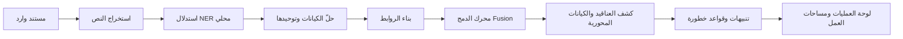
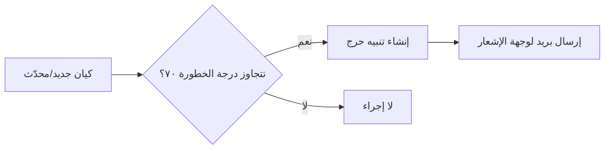

# دليل المزايا التحليلية الشامل
### محلّل الكيانات — Strategic Data Fusion Engine

> مرجع تنفيذي يوثّق كل قدرة تحليلية في النظام، مع شكل توضيحي لكل وحدة، وسيناريوهات استخدام واقعية، وأمثلة بيانات.
>
> **البيئة المستهدفة:** محطة عمل معزولة عن الشبكة (NVIDIA DGX Spark) — استدلال محلي عبر Ollama، قاعدة SQLite محلية، ومرحّلة بريد SMTP داخلية.

---

## الفهرس

1. [نظرة عامة معمارية](#1-نظرة-عامة-معمارية)
2. [لوحة العمليات (Dashboard)](#2-لوحة-العمليات-dashboard)
3. [خط معالجة المستندات واستخراج الكيانات (NER)](#3-خط-معالجة-المستندات-واستخراج-الكيانات-ner)
4. [محرك الدمج والارتباط (Fusion Engine)](#4-محرك-الدمج-والارتباط-fusion-engine)
5. [قاعدة البيانات والكيانات](#5-قاعدة-البيانات-والكيانات)
6. [فهرس العلاقات وشبكة التحليل](#6-فهرس-العلاقات-وشبكة-التحليل)
7. [مساحات العمل (Workspaces)](#7-مساحات-العمل-workspaces)
8. [مسار العلاقات (Path Analysis)](#8-مسار-العلاقات-path-analysis)
9. [تتبع التغيّرات (Change Tracking)](#9-تتبع-التغيّرات-change-tracking)
10. [الفجوات التحليلية (Intelligence Gaps)](#10-الفجوات-التحليلية-intelligence-gaps)
11. [مقارنة الفترات (Period Comparison)](#11-مقارنة-الفترات-period-comparison)
12. [البحث وبحث عبر اللغات](#12-البحث-وبحث-عبر-اللغات)
13. [التنبيهات ومحرك الأحداث المعقّدة (CEP)](#13-التنبيهات-ومحرك-الأحداث-المعقدة-cep)
14. [التركيبة السكانية والإحصاءات السنوية](#14-التركيبة-السكانية-والإحصاءات-السنوية)
15. [أمن العبور والبيانات (Transit Security)](#15-أمن-العبور-والبيانات-transit-security)
16. [الإعدادات ووجهة الإشعارات](#16-الإعدادات-ووجهة-الإشعارات)

---

## 1. نظرة عامة معمارية

النظام **محرك بيانات مركزي** يستوعب مصادر متعددة (سجلات مكالمات، معاملات مالية، تقارير شرطة، تقارير تحليلية) ويحوّلها تلقائياً إلى شبكة كيانات وروابط قابلة للاستعلام والتحليل.



**المكوّنات الأساسية:**

| المكوّن | التقنية | الدور |
|---|---|---|
| قاعدة البيانات | SQLite (محلي) | تخزين الكيانات والروابط والمستندات والتنبيهات |
| الاستدلال اللغوي | Ollama — Llama 3.1 | استخراج الكيانات والعلاقات والتلخيص |
| حلّ الكيانات | Jaro-Winkler + Soundex + معرّفات قوية | توحيد السجلات المكررة |
| محرك الدمج | تحليل عناقيد / درجات / تشارك | كشف الروابط الخفية عبر المستندات |
| محرك التنبيهات | CEP + قواعد خطورة | مطابقة قوائم المراقبة والعتبات |
| الواجهة | React + Tailwind (RTL) | لوحة عمليات ومساحات عمل تحليلية |

---

## 2. لوحة العمليات (Dashboard)


**الوصف:** واجهة القيادة المركزية التي تعرض مؤشرات الأداء الحيّة، أحدث المستندات، أبرز الكيانات، والتحليلات التركيبية — كلها قابلة للتصفية حسب السنة.

**المؤشرات المعروضة:**
- عدد المستندات · عدد الكيانات · عدد الروابط · المستندات قيد المعالجة · التنبيهات الجديدة.

**التفاعل:** كل بطاقة KPI تربط مباشرة بصفحة السجلات المعنية (مثلاً بطاقة "الكيانات" تفتح `/entities`).

### مثال استخدام
> المحلّل يفتح اللوحة صباحاً ويرى ٣ تنبيهات جديدة. يضغط بطاقة "تنبيهات جديدة" فينتقل مباشرة إلى قائمة التنبيهات لمراجعة مطابقات قائمة المراقبة. يختار تصفية "عام ٢٠٢٥" من أعلى اليمين فتتحدّث كل المؤشرات والرسوم البيانية لتعكس بيانات ذلك العام فقط.

---

## 3. خط معالجة المستندات واستخراج الكيانات (NER)

**الوصف:** عند رفع مستند، يُشغّل النظام تلقائياً خط معالجة متكامل:

1. **استخراج النص** من الملف (PDF/صورة/نص) عبر خدمة الاستخراج.
2. **استدلال الكيانات** عبر نموذج لغوي محلي يُخرج: الأشخاص، المنظمات، الشركات، أرقام الهواتف، البريد، المواقع، الحسابات، التواريخ، الأحداث.
3. **استخراج العلاقات** بين الكيانات المذكورة في نفس السياق.
4. **حلّ الكيانات** — مطابقة الكيان المستخرج بقاعدة بيانات موجودة (اسم + تاريخ ميلاد + تطابق صوتي Soundex + معرّفات قوية كرقم الجواز).
5. **التأريخ التلقائي** — استخراج `reference_date` من المستند وأرشفته تلقائياً في ملف (Workspace) خاص بالسنة.

### مثال بيانات مستخرجة

**مستند وارد:** `سجل مكالمات — 2025-03-14`

```json
{
  "entities": [
    { "name": "أحمد عبدالله", "type": "person", "attributes": { "passport": "A1234567", "dob": "1986-04-12" } },
    { "name": "+963991234567", "type": "phone" },
    { "name": "شركة النقل المتحدة", "type": "company" }
  ],
  "relationships": [
    { "source": "أحمد عبدالله", "target": "+963991234567", "type": "يملك" },
    { "source": "أحمد عبدالله", "target": "شركة النقل المتحدة", "type": "يعمل لدى" }
  ],
  "reference_date": "2025-03-14"
}
```

بعد المعالجة يُؤرشف المستند تلقائياً في مساحة عمل **"ملف ٢٠٢٥"** وتُحدّث درجات ذكر الكيانات وروابطها.

---

## 4. محرك الدمج والارتباط (Fusion Engine)


**الوصف:** محرك مركزي يربط البيانات من مصادر متعددة تلقائياً ويكشف الارتباطات الخفية عبر المستندات. يعمل عند الطلب أو ضمن خط المعالجة.

**مخرجات المحرك:**

| المخرج | الوصف |
|---|---|
| **العناقيد الشبكية** | مجموعات كيانات مترابطة كثيفاً — قابلة للتوسيع لعرض الروابط الداخلية والمصادر |
| **الكيانات المحورية** | الكيانات الأعلى درجة (أكثر ارتباطاً) — نقاط التقاء بين شبكات |
| **التشارك المشترك** | أزواج كيانات تظهر معاً في عدة مستندات (مؤشر ارتباط قوي) |
| **شبكة الخطورة** | كيانات عالية الخطورة وعدد جيرانها |
| **الكيانات المعزولة** | كيانات بلا روابط — مرشّحة للاستكمال |
| **تقرير التوحيد** | مجموعات الكيانات المدمجة والكنسيّة |

### مثال: كشف ارتباط خفي
> يظهر في مستند ٢٠٢٤ شخص "أحمد ع." يحمل هاتف +963991234567. ويظهر في مستند ٢٠٢٥ شخص "أبو عبدالله" يحمل نفس الرقم. محرك الدمج يربط المستندين عبر الرقم المشترك ويصنّفهما كياناً واحداً محتملاً (تطابق معرّف قوي) فيدرجهما في نفس العنقود ويُظهرهما في تقرير التوحيد بنسبة تطابق ١٠٠٪.

---

## 5. قاعدة البيانات والكيانات

**الوصف:** سجل مركزي لكل الكيانات المستخرجة، مع إعادة تصنيف يدوية بين (منظمة / شركة)، وعرض سمات تفصيلية (رقم الجواز، الهاتف، صورة الكيان)، ومحرّر PII.

**أنواع الكيانات المدعومة:** شخص · منظمة · شركة · هاتف · بريد · موقع · حساب · تاريخ · حدث · أخرى.

**التفاعل:**
- تصفية حسب النوع في اللوحة اليسرى.
- إعادة تصنيف يدوي بين منظمة وشركة.
- تعديل السمات والسمات الإضافية مباشرة.
- الانتقال إلى الملف الكامل للكيان.

### مثال: إعادة تصنيف
> الكيان "مؤسسة الموانئ" صُنّف تلقائياً كـ "شركة". يراجع المحلّل ويجد أنها كيان حكومي، فيعيد تصنيفها إلى "منظمة" من محرّر قاعدة البيانات. يُحدّث النوع فوراً وتنعكس التغييرات على كل التحليلات.

---

## 6. فهرس العلاقات وشبكة التحليل


**الوصف:** عرض شبكي تفاعلي للعلاقات. الوضع الافتراضي **مُستند إلى المستندات** (Document-driven) يعرض الكيانات والروابط المستخرجة تلقائياً، مع وضع يدوي ثانوي للتحرير المباشر.

**القدرات:**
- توسيع العقدة لعرض الجيران من الدرجة الأولى.
- إبراز الكيانات المحورية والعناقيد.
- تصفية حسب نوع العلاقة.
- عرض سمات الكيان (رقم الجواز/الهاتف) داخل بطاقة المعلومات عند الاختيار.

### مثال: استكشاف شبكة
> يختار المحلّل كيان "شركة النقل المتحدة" فيُعرض له عدد روابطها (٧). يوسّع العقدة فتظهر ٥ كيانات متصلة: ٣ أشخاص يعملون لديها، وهاتف واحد، وحساب بنكي. يضغط على الهاتف فتظهر بطاقة تفصيلية برقمه وعدد مرات ذكره في المستندات.

---

## 7. مساحات العمل (Workspaces)

**الوصف:** ملفات تحليلية تُجمّع كيانات ومستندات مختارة في جلسة تحليل واحدة، بأسلوب سحب وإفلات شبكي (Kharon-style). الأرشفة السنوية تلقائية (ملف ٢٠٢٤، ملف ٢٠٢٥...).

**تبويبات مساحة العمل:**
1. **شبكة التحليل** — العرض الشبكي التفاعلي (المحور الأساسي).
2. **الكيانات** — جدول كيانات المساحة.
3. **المستندات** — المستندات المحمّلة.
4. **التحليل** — أدوات تحليل الاختيار.
5. **التقرير** — تقرير تحقيقي قابل للتصدير PDF.

### مثال سير عمل
> يُنشئ المحلّل مساحة "خلية التهريب البحري"، يضيف ٦ كيانات مشبوهة و٤ مستندات. ينتقل إلى تبويب "شبكة التحليل" ليرسم الروابط يدوياً بين كيانين لم يرصدهما المحرك. ثم يفتح "التقرير" ويُصدّر تقريراً تحقيقياً PDF يلخّص الكيانات والعلاقات والمستندات.

---

## 8. مسار العلاقات (Path Analysis)


**الوصف:** أداة لاكتشاف مسارات الربط بين كيانين — كم درجة تفصل بينهما، وما الكيانات الوسيطة، وما قوة كل خطوة.

### مثال: ربط مشتبه به بمنظّمة
> يريد المحلّل معرفة إن كان "أحمد عبدالله" مرتبطاً بـ "شركة النقل المتحدة". يختار الكيانين في الأداة فيجد مساراً بطول ٣:
> ```
> أحمد عبدالله —(يملك)—> +963991234567 —(يُستخدم بواسطة)—> خالد سليم —(يعمل لدى)—> شركة النقل المتحدة
> ```
> يُسلّط هذا المسار الضوء على "خالد سليم" كحلقة وسيطة لم تكن مرصودة سابقاً.

---

## 9. تتبع التغيّرات (Change Tracking)

**الوصف:** يرصد ما أُضيف حديثاً إلى النظام (كيانات، روابط، مستندات، تنبيهات) منذ تاريخ أساسي قابل للتعديل — لرصد التطور الزمني للشبكة.

### مثال
> يضبط المحلّل التاريخ الأساسي إلى ٢٠٢٥-٠٩-٠١. تُظهر الأداة: ١٢ كياناً جديداً، ٢٨ رابطاً جديداً، ٥ مستندات، وتنبيهين — كلها أُضيفت بعد ذلك التاريخ، مع روابط مباشرة لكل سجل.

---

## 10. الفجوات التحليلية (Intelligence Gaps)

**الوصف:** أداة تشخيصية تُبرز نقاط الضعف في التغطية:
- كيانات بذكر واحد فقط (معلومات محدودة).
- عُقد معزولة (بلا روابط).
- روابط ضعيفة الدليل.
- مستندات غير محلّلة (نص فارغ/فشل).

### مثال
> تُظهر الأداة ٤ كيانات معزولة تماماً و٣ مستندات فشل استخراج النص منها. يبدأ المحلّل منها كأولويات للاستكمال وإعادة المعالجة.

---

## 11. مقارنة الفترات (Period Comparison)

**الوصف:** تقارن مقاييس شبكتين زمنيتين (مثلاً ٢٠٢٤ مقابل ٢٠٢٥) لإبراز الاتجاهات: نمو الكيانات، تغيّر أنواع الروابط، ظهور كيانات محورية جديدة.

### مثال
> مقارنة ٢٠٢٤ بـ ٢٠٢٥ تكشف: ارتفاع الروابط المالية ٤٠٪، وظهور شركة "النقل المتحدة" ككيان محوري جديد لم يكن كذلك في ٢٠٢٤، وتراجع ذكر كيان "خالد سليم".

---

## 12. البحث وبحث عبر اللغات

**البحث الشامل:** بحث في الكيانات والمستندات والروابط بالاسم/الاسم البديل/المعرّف.

**بحث عبر اللغات (CLIR):** يبحث بالاسم في لغة ويعثر على المرادفات والترجمات عبر اللغات — مفيد لتتبع كيانات تُكتب بأشكال متعددة (عربي/لاتيني/محوّل صوتي).

### مثال
> البحث عن "Ahmad Abdullah" يُرجع الكيان "أحمد عبدالله" رغم اختلاف الكتابة، بفضل التطابق الصوتي Soundex والتطبيع العربي.

---

## 13. التنبيهات ومحرك الأحداث المعقّدة (CEP)

**الوصف:** قواعد خطورة قابلة للتهيئة (عتبة خطورة، قائمة مراقبة، كيان محوري، تشارك، حجم عنقود). عند تحقّق شرط، يُولّد تنبيه ويُرسل إشعار بريد لوجهة الإشعار المُعدّة.

### مثال قاعدة
> قاعدة "كيان عالي الخطورة": أي كيان تتجاوز درجة خطورته ٧٠ يُولّد تنبيه حرج ويُرسل بريد إلى القائمة المُعدّة في الإعدادات.



---

## 14. التركيبة السكانية والإحصاءات السنوية

**التركيبة السكانية:** توزيع الجنسيات والمواقع الجغرافية للكيانات (أشخاص) مع تصفية سنوية، وروابط لصفحات تفصيل الجنسية.

**الإحصاءات السنوية:** لوحة تنفيذية لكل عام — حالة المعالجة، توزيع أنواع الكيانات، طوبولوجيا الشبكة، توزيع الخطورة، الاتجاهات الزمنية الشهرية.

### مثال
> صفحة ٢٠٢٥ تعرض: ٤٨ مستنداً معالجاً، ٢٢٠ كياناً، ذروة نشاط في يونيو، الجنسية الأكثر تكراراً "سورية" بـ ٣٥٪.

---

## 15. أمن العبور والبيانات (Transit Security)

**الوصف:** إدارة بيانات الركاب والشحن (جوي/بحري)، فحص آلي ضد قوائم المراقبة والكيانات عالية الخطورة، وتوليد تنبيهات عند المطابقة.

**أنواع البيانات:** ركاب (اسم/جواز/جنسية/تاريخ ميلاد/مقعد) · شحن (وصف/وزن/مستلم/خطر).

### مثال
> يُرفع بيان رحلة جوية بـ ٢٠٠ راكب. يفحصه النظام تلقائياً ضد قائمة المراقبة فيطابق راكباً واحداً برقم جواز موجود في قائمة المراقبة، فيُولّد تنبيه "اعتراض" ويُبرز الراكب في التقرير.

---

## 16. الإعدادات ووجهة الإشعارات


**الوصف:** صفحة الإعدادات تتيح:

1. **وجهة إشعارات البريد** — قائمة بريد تستقبل التنبيهات (مع العودة للمسؤولين إن لم تُضف قائمة).
2. **خادم البريد (SMTP)** — إعداد مرحّلة البريد المحلية للبيئة المعزولة (عنوان/منفذ/تشفير/مُرسِل/اعتمادات).

### مثال إعداد SMTP للبيئة المعزولة
> يُضبط الخادم على `smtp.local` المنفذ `587` مع STARTTLS، ومُرسِل `alerts@local`. عند تولّد تنبيه حرج، يُرسل النظام البريد عبر هذه المرحّلة المحلية دون أي اتصال بالإنترنت.

---

## ملخص المزايا التحليلية

| الميزة | الفئة | القيمة التحليلية |
|---|---|---|
| خط NER التلقائي | استيعاب | تحويل المستندات إلى كيانات وعلاقات |
| حلّ الكيانات | دمج | توحيد السجلات المكررة عبر المستندات |
| محرك الدمج | دمج | كشف الروابط والعناقيد الخفية |
| شبكة التحليل | تصور | استكشاف تفاعلي للشبكة |
| مسار العلاقات | تحليل | اكتشاف مسارات الربط بين كيانين |
| تتبع التغيّرات | تحليل | رصد التطور الزمني |
| الفجوات التحليلية | تشخيص | تحديد نقاط ضعف التغطية |
| مقارنة الفترات | تحليل | إبراز الاتجاهات بين فترتين |
| بحث عبر اللغات | بحث | تتبع الكيانات عبر الكتابات |
| محرك التنبيهات CEP | عمليات | تنبيهات لحظية عند تحقّق الشروط |
| أمن العبور | عمليات | فحص بيانات الركاب والشحن |
| الإحصاءات السنوية | تقارير | لوحة تنفيذية لكل عام |

---

*محلّل الكيانات — Strategic Data Fusion Engine · مرجع تنفيذي · البيئة المعزولة*